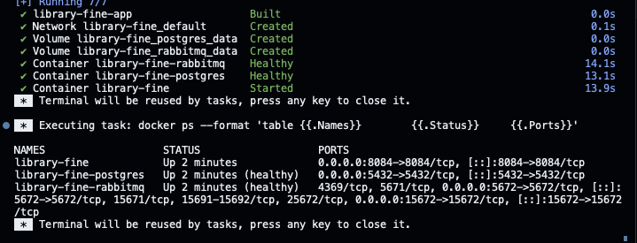
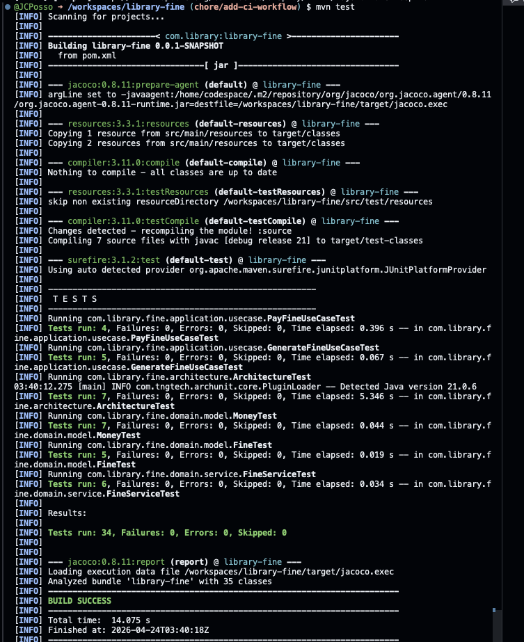

# library-fine

Microservicio responsable del bounded context **Gestión de Multas** dentro del sistema de biblioteca digital.

Gestiona el ciclo de vida de las multas por devolución tardía de libros: generación automática, consulta y pago. Es el único dueño del estado de cada multa y reacciona a eventos de `library-rental` para calcularlas automáticamente.

**Stack:** Java 21 · Spring Boot 3.2 · PostgreSQL · RabbitMQ · Flyway · Maven

---

## Bounded context

| Elemento | Detalle |
|---|---|
| Eventos que publica | `FineGeneratedEvent`, `FinePaidEvent` |
| Eventos que consume | `BookReturnedEvent`, `RentalOverdueEvent` (de `library-rental`) |
| Agregado principal | `Fine` |
| Políticas | 1 USD por día de atraso · no se puede generar una multa dos veces para el mismo préstamo · solo multas PENDING pueden pagarse |

---

## Arquitectura interna — Clean Architecture

```
  HTTP / RabbitMQ
        │
        ▼
┌──────────────────────────────────────────────────┐
│  INTERFACES                                       │
│  FineController · GlobalExceptionHandler          │
│  BookReturnedEventConsumer                        │
│  RentalOverdueEventConsumer                       │
└──────────────────────┬───────────────────────────┘
                       │
                       ▼
┌──────────────────────────────────────────────────┐
│  APPLICATION                                      │
│  GenerateFineUseCase   GetFineUseCase             │
│  PayFineUseCase        GetUserFinesUseCase        │
│                                                   │
│  FineEventPublisher  ← puerto (interfaz)          │
└──────────┬───────────────────────────────────────┘
           │
           ▼
┌──────────────────────────────────────────────────┐
│  DOMAIN  (sin dependencias de frameworks)         │
│  Fine (Aggregate Root)                            │
│  ├─ FineId · RentalId · UserId · Money  (VOs)    │
│  ├─ FineStatus                          (enum)    │
│  └─ FineGeneratedEvent · FinePaidEvent            │
│                                                   │
│  FineService · FineRepository                     │
└──────────┬───────────────────────────────────────┘
           │ implementado por
           ▼
┌──────────────────────────────────────────────────┐
│  INFRASTRUCTURE                                   │
│  FineRepositoryImpl     ← JPA + FineMapper        │
│  OutboxFineEventPublisher ← guarda en DB          │
│  OutboxPublisherJob       ← publica a RabbitMQ   │
│  RabbitMQConfig                                   │
└──────────────────────────────────────────────────┘
```

Regla de dependencia: las flechas apuntan siempre hacia adentro. El dominio no conoce Spring, JPA ni RabbitMQ.

---

## Flujos

### 1. Generación automática de multa por devolución tardía

```
library-rental
  │
  │  BookReturnedEvent { rentalId, userId, dueDate, returnDate }
  │  routing key: rental.rental.book_returned.v1
  ▼
RabbitMQ
  Exchange: rental
  Queue:    fine.book-returned
  DLQ:      fine.book-returned.dlq  ← si falla reiteradamente
  ▼
BookReturnedEventConsumer
  │  calcula daysOverdue = Duration.between(dueDate, returnDate).toDays()
  ▼
GenerateFineUseCase  @Transactional ─────────────────────────────────
  │  verifica existsByRentalId → idempotencia (una multa por préstamo)  │  misma
  │  FineService.generateFine(rentalId, userId, daysOverdue)            │  transacción
  │    └─ calcula amount = daysOverdue × 1.00 USD                       │
  │  fineRepository.save(fine)     → INSERT INTO fines                  │
  │  eventPublisher.publish(...)   → INSERT INTO outbox_events          │
  ──────────────────────────────────────────────────────────────────── COMMIT

  (cada 5 segundos)
OutboxPublisherJob  @Scheduled
  │  SELECT * FROM outbox_events WHERE published = false
  │  rabbitTemplate.send("fine", "fine.fine.fine_generated.v1", payload)
  └─ UPDATE outbox_events SET published = true
```

### 2. Generación automática de multa por préstamo vencido

```
library-rental
  │
  │  RentalOverdueEvent { rentalId, userId, daysOverdue }
  │  routing key: rental.rental.rental_overdue.v1
  ▼
RabbitMQ → Queue: fine.rental-overdue
  ▼
RentalOverdueEventConsumer
  └─▶ GenerateFineUseCase  (mismo flujo que arriba, idempotente)
```

### 3. Pago de una multa

```
Cliente
  │  POST /fines/{fineId}/pay
  ▼
FineController
  └─▶ PayFineUseCase  @Transactional ────────────────────────────────
        │  fineRepository.findById(fineId)  → 404 si no existe         │  misma
        │  fine.pay(now)  → lanza FineAlreadyPaidException si es PAID  │  transacción
        │  fineRepository.save(fine)   → UPDATE fines SET status='PAID' │
        │  eventPublisher.publish(...)  → INSERT INTO outbox_events     │
        ────────────────────────────────────────────────────────────── COMMIT

  (cada 5 segundos)
OutboxPublisherJob
  └─ publica FinePaidEvent → routing key: fine.fine.fine_paid.v1
```

### 4. Outbox Pattern — publicación confiable de eventos

```
SIN outbox (problema):
  1. INSERT INTO fines    ✓
  2. COMMIT               ✓
  3. rabbitMQ.send()      ✗  falla → evento perdido para siempre

CON outbox (implementado):
  1. INSERT INTO fines          ─┐
  2. INSERT INTO outbox_events  ─┤ misma transacción → atómico
  3. COMMIT                     ─┘

  (scheduler independiente cada 5s)
  4. rabbitMQ.send()           si falla → outbox queda published=false
  5. UPDATE published = true   → reintento automático en el siguiente ciclo
```

### 5. Contexto del sistema completo

```
                    ┌──────────────────────────────────────────┐
                    │         RabbitMQ (Event Bus)              │
                    └──────┬───────────────┬───────────────────┘
                           │               │
           ┌───────────────┘               └──────────────────┐
           ▼                                                   ▼
┌──────────────────────┐               ┌──────────────────────────────┐
│  library-rental       │               │  library-fine (este servicio) │
│  BookReturnedEvent   ─────────────────▶  puerto 8084                 │
│  RentalOverdueEvent  ─────────────────▶                              │
│  puerto 8083          │               │  publica:                     │
└──────────────────────┘               │  FineGeneratedEvent ──────────┼──▶ otros servicios
                                        │  FinePaidEvent       ──────────┼──▶ otros servicios
                                        └──────────────────────────────┘
```

---

## API REST

| Método | Endpoint | Descripción |
|---|---|---|
| `GET` | `/fines/{fineId}` | Obtener multa por ID |
| `POST` | `/fines/{fineId}/pay` | Pagar una multa pendiente |
| `GET` | `/fines?userId=&onlyPending=` | Listar multas de un usuario |

**Parámetros de consulta para `GET /fines`:**
- `userId` *(requerido)* — UUID del usuario
- `onlyPending` *(opcional, default `false`)* — si `true`, retorna solo multas con estado `PENDING`

**Errores estándar (RFC 9457 ProblemDetail):**

| HTTP | Causa |
|---|---|
| `404 Not Found` | `FineNotFoundException` — multa no existe |
| `409 Conflict` | `FineAlreadyPaidException` — multa ya fue pagada |
| `400 Bad Request` | `IllegalArgumentException` — argumento inválido |

---

## Levantar con Docker

```bash
# Primera vez o al cambiar código
docker compose up --build

# Arrancar sin reconstruir
docker compose up

# Limpiar todo incluyendo datos
docker compose down -v
```

| Servicio | URL |
|---|---|
| API | http://localhost:8084 |
| Actuator health | http://localhost:8084/actuator/health |
| Swagger UI | http://localhost:8084/swagger-ui.html |
| OpenAPI JSON | http://localhost:8084/v3/api-docs |
| RabbitMQ Management | http://localhost:15672 (guest / guest) |
| PostgreSQL | localhost:5432 → db: `library_fine` |

### Evidencia de ejecución

La siguiente captura muestra el stack levantado y los contenedores corriendo en este entorno:



## Documentación adicional

- [Arquitectura del servicio](docs/architecture.md)
- [Guía de verificación funcional](docs/verification.md)

---

## Variables de entorno

| Variable | Default | Descripción |
|---|---|---|
| `DB_HOST` | `localhost` | Host de PostgreSQL |
| `DB_PORT` | `5432` | Puerto de PostgreSQL |
| `DB_NAME` | `library_fine` | Nombre de la base de datos |
| `DB_USER` | `library` | Usuario de la base de datos |
| `DB_PASSWORD` | `library` | Contraseña de la base de datos |
| `RABBITMQ_HOST` | `localhost` | Host de RabbitMQ |
| `RABBITMQ_PORT` | `5672` | Puerto de RabbitMQ |
| `RABBITMQ_USER` | `guest` | Usuario de RabbitMQ |
| `RABBITMQ_PASSWORD` | `guest` | Contraseña de RabbitMQ |
| `RABBITMQ_VHOST` | `/` | Virtual host de RabbitMQ |
| `SERVER_PORT` | `8084` | Puerto del servidor HTTP |
| `OUTBOX_POLL_INTERVAL_MS` | `5000` | Intervalo de polling del Outbox en ms |

---

## Base de datos

```sql
-- Flyway V1
fines (
  fine_id      UUID PRIMARY KEY,
  rental_id    UUID UNIQUE NOT NULL,   -- garantía DB de idempotencia
  user_id      UUID NOT NULL,
  amount       NUMERIC(10,2) NOT NULL,
  currency     VARCHAR(3) NOT NULL,
  status       VARCHAR(20) NOT NULL,   -- PENDING | PAID
  generated_at TIMESTAMPTZ NOT NULL,
  paid_at      TIMESTAMPTZ
)

-- Flyway V2
outbox_events (
  event_id     UUID PRIMARY KEY,
  event_type   VARCHAR(100) NOT NULL,
  routing_key  VARCHAR(200) NOT NULL,
  exchange     VARCHAR(100) NOT NULL,
  payload      TEXT NOT NULL,
  occurred_at  TIMESTAMPTZ NOT NULL,
  published    BOOLEAN NOT NULL DEFAULT FALSE,
  published_at TIMESTAMPTZ
)
-- índice parcial para polling eficiente:
-- CREATE INDEX idx_outbox_unpublished ON outbox_events (published, occurred_at) WHERE published = FALSE
```

---

## Mensajería RabbitMQ

### Exchanges

| Exchange | Tipo | Propósito |
|---|---|---|
| `fine` | Direct | Publica eventos de este servicio |
| `rental` | Direct | Consume eventos de `library-rental` |
| `fine.dlx` | Direct | Dead-letter exchange para mensajes fallidos |

### Colas consumidas

| Cola | Routing key | DLQ |
|---|---|---|
| `fine.book-returned` | `rental.rental.book_returned.v1` | `fine.book-returned.dlq` |
| `fine.rental-overdue` | `rental.rental.rental_overdue.v1` | `fine.rental-overdue.dlq` |

### Eventos publicados

| Evento | Routing key | Exchange |
|---|---|---|
| `FineGeneratedEvent` | `fine.fine.fine_generated.v1` | `fine` |
| `FinePaidEvent` | `fine.fine.fine_paid.v1` | `fine` |

---

## Tests

```bash
# Unit tests (sin infraestructura)
mvn test

# Con reporte de cobertura (mínimo 80%)
mvn verify
```

| Capa | Tipo | Qué verifica |
|---|---|---|
| Domain | Unit | Invariantes de `Fine`, `Money`, `FineService` |
| Application | Unit | Use cases con repositorio in-memory (sin mocks, sin Spring) |
| Architecture | ArchUnit | Dependencias entre capas (7 reglas) |

### Reglas de arquitectura (ArchUnit)

1. El dominio no depende de Spring
2. El dominio no depende de infrastructure
3. El dominio no depende de interfaces
4. La capa application no depende de infrastructure
5. La capa application no depende de interfaces
6. La capa interfaces no accede directamente a persistence
7. La arquitectura por capas es respetada globalmente

### Evidencia de tests

La siguiente captura muestra la ejecución de `mvn test` en este entorno:


