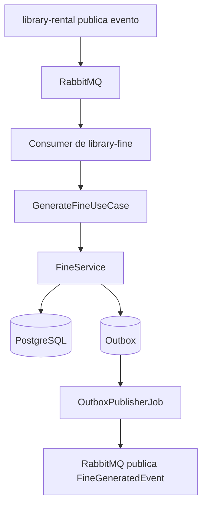

# Arquitectura de `library-fine`

Este microservicio administra el ciclo de vida de las multas del sistema de biblioteca. Su responsabilidad principal es generar, consultar y marcar como pagadas las multas derivadas de devoluciones tardías o préstamos vencidos.

## Responsabilidad del servicio

- Recibir eventos desde `library-rental` por RabbitMQ.
- Calcular y persistir multas en PostgreSQL.
- Publicar eventos de dominio mediante Outbox para evitar pérdida de mensajes.
- Exponer una API REST para consulta y pago de multas.

## Componentes principales

- `interfaces/rest`: controladores HTTP y manejo de errores.
- `interfaces` / consumidores RabbitMQ: entrada asíncrona de eventos.
- `application`: casos de uso y puertos.
- `domain`: entidad `Fine`, value objects, reglas de negocio y eventos.
- `infrastructure`: JPA, RabbitMQ, Outbox y configuración.

## Flujo de generación de multa



## Flujo de pago

```mermaid
flowchart TD
  A[Cliente] --> B[POST /fines/{id}/pay]
  B --> C[PayFineUseCase]
  C --> D[Fine.pay()]
  D --> E[(PostgreSQL)]
  D --> F[(Outbox)]
  F --> G[OutboxPublisherJob]
  G --> H[RabbitMQ publica FinePaidEvent]
```

## Decisiones importantes

- La idempotencia se asegura por `rental_id` único en base de datos.
- La publicación de eventos se desacopla con Outbox para no perder mensajes si RabbitMQ falla.
- El dominio no depende de Spring, JPA ni RabbitMQ.
- Solo las multas `PENDING` pueden pasar a `PAID`.

## Servicios externos

- PostgreSQL: persistencia de multas y outbox.
- RabbitMQ: intercambio de eventos con otros microservicios.
